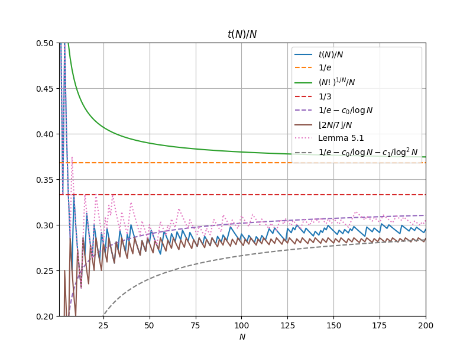
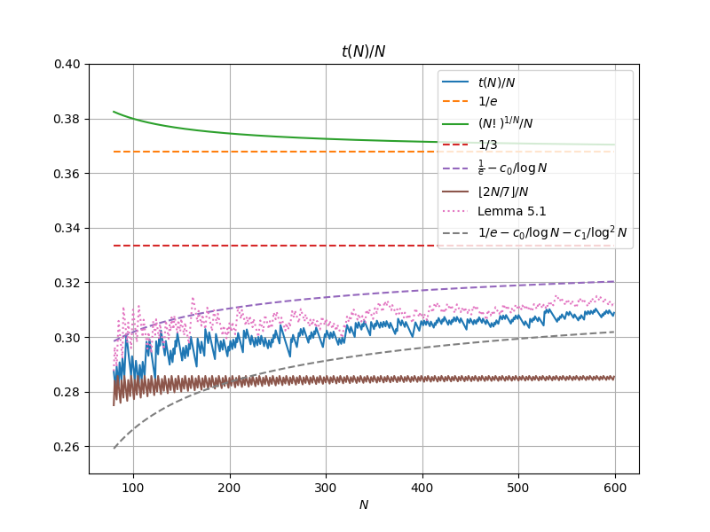

# Verifying the Guy-Selfridge conjecture

For a natural number $N$, let $t(N)$ be the largest number such that $N!$ can be factored into $N$ integer factors, each of which is at least $t(N)$.  It is known that $\frac{1}{e} - \frac{c_0+O(\log^{-c} N)}{\log N} \leq \frac{t(N)}{N} \leq \frac{1}{e} - \frac{c_0}{\log N} -\frac{c_1+o(1)}{\log^2 N}$,
where $c_0 := \frac{1}{e} \int_0^1 \left \lfloor \frac{1}{x} \right\rfloor \log \left( ex \left \lceil \frac{1}{ex} \right\rceil \right)\ dx = 0.304419010\dots,$
answering a question of [Erdős and Graham](https://www.erdosproblems.com/391).  Here $c_1$ is the explicit constant $c_1 := c^\prime_1 + c_0 {c_1}^{\prime\prime} - ec_0^2/2 = 0.75554808\dots$, where ${c_1}^\prime := \frac{1}{e} \int_0^1 \left \lfloor \frac{1}{x} \right\rfloor \log \left( ex \left \lceil \frac{1}{ex} \right\rceil \right) \log \frac{1}{x}\ dx = 0.3702051\dots$ and ${c_1}^{\prime\prime} :=  \sum_{k=1}^\infty \frac{1}{k}  \log\left( \frac{e}{k} \left\lceil \frac{k}{e} \right\rceil \right) = 1.679587996\dots$. 

Here is a graph of the integral defining $c_0$:

And here is a plot of $t(N)/N$ against some comparators for $N \leq 79$:

Here is an extension of that image to $N \leq 200$:

A view of $80 \leq N \leq 599$:

An enlargement of the previous graph, also including the greedy algorithm lower bound:

This repository records the efforts to verify the [Guy-Selfridge conjectures](https://zbmath.org/0918.11013) concerning the sequence $t(N)$:

1. $t(N) \geq \lfloor 2N/7 \rfloor$ for all $N \neq 56$.
2. $t(N) \geq N/3$ for all $N \geq 3 \times 10^5$.  How small can the lower threshold $3 \times 10^5$ be?

(A further conjecture of Guy and Selfridge that $t(N) \leq N/e$ for $N \neq 1,2,4$ [has been solved](https://arxiv.org/abs/2503.20170).) 

Secondary goals are

3.  Extend the values of $t(N)$ reported in the OEIS (which [are listed up to](https://oeis.org/A034258/b034258.txt))  $N \leq 79$, and which can be extended to $N \leq 200$ by inverting [OEIS A034259](https://oeis.org/A034259).
4.  Obtain more accurate values for $c_0$ and $c_1$.

## Current status

1. Conjecture 1 **has been fully verified**, as a consequence of Conjecture 2 for $N \geq 43632$, and either the greedy or linear programming method for $N < 43632$.
2. Conjecture 2 **has been verified** for all $N \geq 43632$, and is known to fail for $N = 43631$.  For $N \leq 8 \times 10^4$; these facts can be obtained by a linear programming method; for $8 \times 10^4 < N \leq 10^{11}$ by a modified greedy method; and for $N \geq 10^{11}$ by a modified approximate factorization method. A separate modified greedy method has verified the range $10^6 \leq N \leq 10^{12}$.  The smallest $N$ for which the conjecture holds (excluding the small cases $N=1,2,3,4,5,6,9$) is $N=41006$.  
3. The OEIS tables have been extended to $N \leq 10000$ by the linear programming method (combined with integer programming to handle a few rare cases where the linear programming bounds are not tight).
4. Using interval arithmetic and rigorous error bounds, one has $c_0 = 0.304419010\dots$ and $c_1 = 0.75554808\dots$.Non-rigorous heuristic calculations predict that $c_0 \approx 0.30441901087$.  

## Timeline on controlling $t(N)$

| Date | Contributor | Goal | $N$ | Method | Comments |
| --- | --- | --- | --- | --- | --- |
| [Oct 1998](https://www.jstor.org/stable/2588996) | Richard Guy and John Selfridge | 1,3 | $[1,79]$ | Unknown | Exact value computed
| [12 May 2001](https://oeis.org/A034258) | Robert G. Wilson | 1, 3 | $[1,79]$ | Unknown | Exact value computed
| [29 Nov 2001](https://oeis.org/A034259) | Don Reble | 1,  3 | $[1, 200]$ | Unknown | Exact value computed
| [26 Mar 2025](https://arxiv.org/abs/2503.20170v1) | Terence Tao | 1, 2 | Sufficiently large | Modify an approximate factorization | Back of the envelope calculations suggest that this construction works for $N \gtrapprox 10^{11}$
| [27 Mar 2025](https://terrytao.wordpress.com/2025/03/26/decomposing-a-factorial-into-large-factors/#comment-687574) | Andrew Sutherland | 1 | $[1,10^5]$ | Greedy | N = [182](https://math.mit.edu/~drew/ES182.txt), [200](https://math.mit.edu/~drew/ES200.txt), [207](https://math.mit.edu/~drew/ES207.txt) treated separately
|  [27 Mar 2025](https://terrytao.wordpress.com/2025/03/26/decomposing-a-factorial-into-large-factors/#comment-687574) | Andrew Sutherland | 2 | $[298344, 3 \times 10^5]$ | Greedy | Surplus of 372 at $N=3 \times 10^5$
| [3 Apr 2025](https://terrytao.wordpress.com/2025/03/26/decomposing-a-factorial-into-large-factors/#comment-687641) | Matthieu Rosenfeld | 2 | $3 \times 10^5$ | Improved greedy | Surplus of 393
| [3 Apr 2025](https://terrytao.wordpress.com/2025/03/26/decomposing-a-factorial-into-large-factors/#comment-687646) | Markus Uhr | 2 | $3 \times 10^5$ | Linear program | Surplus of 455; likely optimal
| [4 Apr 2025](https://terrytao.wordpress.com/2025/03/26/decomposing-a-factorial-into-large-factors/#comment-687655) | Matthieu Rosenfeld | 2 | $[138075, 5 \times 10^5]$ | Improved greedy
| [5 Apr 2025](https://terrytao.wordpress.com/2025/03/26/decomposing-a-factorial-into-large-factors/#comment-687676) | Kevin Ventullo | 2 | $[3 \times 10^5, 10^8$] | Improved greedy 
| [6 Apr 2025](https://terrytao.wordpress.com/2025/03/26/decomposing-a-factorial-into-large-factors/#comment-687676) | Kevin Ventullo | 2 | $[8 \times 10^4, 3 \times 10^8$] | Improved greedy | Conjecture 1 is now reduced to Conjecture 2
| [6 Apr 2025](https://terrytao.wordpress.com/2025/03/26/decomposing-a-factorial-into-large-factors/#comment-687695) | Matthieu Rosenfeld | 2 | $[8 \times 10^4, 10^9]$ | Improved greedy
| [8 Apr 2025](https://gus-massa.blogspot.com/2025/04/decomposing-factorial-of-300k-as.html) | Gustavo | 2 | $3 \times 10^5$ | Modify an approximate factorization | 
| [9 Apr 2025](https://github.com/teorth/erdos-guy-selfridge/pull/1) | Markus Uhr | 3 | $[1,600]$ | Linear programming (or integer programming for $N=155$)| LP bound is off by one at $N=155$.
| [11 Apr 2025](https://terrytao.wordpress.com/2025/03/26/decomposing-a-factorial-into-large-factors/comment-page-1/#comment-687728) | Matthieu Rosenfeld | 2 | $[8 \times 10^4, 2 \times 10^{10}]$ | Improved greedy
| [11 Apr 2025](https://github.com/teorth/erdos-guy-selfridge/pull/5) | Boris Alexeev | 2 | $[43632, 80973]$ | Linear programming | 
| [11 Apr 2025](https://github.com/teorth/erdos-guy-selfridge/pull/2#issuecomment-2796186186) | Uhrmar | 2 | $\neg 43631$; $[43632,8 \times 10^4]$ | Linear programming | Provisional limit of Conjecture 2 reached 
| [12 Apr 2025](https://github.com/teorth/erdos-guy-selfridge/pull/8) | Evan Conway | 2 | $\neg[1,15000] \cup [38000,42000]$ $\backslash \{1,2,3,4,5,6,9,41006\}$ | Linear programming | $41006$ is the smallest known $N>9$ where Conjecture 2 holds
| [13 Apr 2025](https://github.com/teorth/erdos-guy-selfridge/pull/13) | Boris Alexeev | 2 | Sufficiently large | Redistributing small factors from standard factorization
| [14 Apr 2025](https://terrytao.wordpress.com/2025/03/26/decomposing-a-factorial-into-large-factors/comment-page-1/#comment-687746) | Matthieu Rosenfeld | 2 | $[10^{10}, 10^{11}]$ | Improved greedy
| [14 Apr 2025](https://github.com/teorth/erdos-guy-selfridge/pull/15) | Boris Alexeev | 2 | $\neg 43631$ | Linear programming | Rigorous certificate of Conjecture 2 failure at this point
| [14 Apr 2025](https://github.com/teorth/erdos-guy-selfridge/issues/19) | Evan Conway | 2 | $\neg [10,41005]$ | Linear programming
| [16 Apr 2025](https://github.com/teorth/erdos-guy-selfridge/pull/24#issuecomment-2811388882) | Boris Alexeev | 3 | $[1,10^4] \backslash$ $\{155,765,1528,1618,1619,2574,2935,3265,5122,5680,9633\}$ | Linear programming
| [17 Apr 2025](https://github.com/teorth/erdos-guy-selfridge/pull/25) | Boris Alexeev | 3 | $[1,10^4]$ | Linear and integer programming |  
| [17 Apr 2025](https://github.com/teorth/erdos-guy-selfridge/commit/95e68bd8cf5234d1f722b3c16de5b0dfb37446bc) | Terence Tao | 2 | $N = 10^{12}$ | Modified approximate factorization + explicit estimates | Lack of monotonicity prevents generalizing to higher $N$  
| [19 Apr 2025](https://github.com/teorth/erdos-guy-selfridge/pull/27) | Terence Tao | 2 | $N = 10^{11}$ | Modified approximate factorization + explicit estimates | Lack of monotonicity prevents generalizing to higher $N$
| [20 Apr 2025](https://github.com/teorth/erdos-guy-selfridge/commit/a8a96161c2c4dc04e06981f5cabe786bd730c76c) | Terence Tao | 2 | $N \geq 10^{11}$ | Modified approximate factorization + explicit estimates + interval arithmetic | Completes verification of Conjectures 2,3
| [20 Apr 2025](https://github.com/teorth/erdos-guy-selfridge/pull/29) | Evan Conway | 2 | $N \geq 6 \times 10^{10}$ | Modified approximate factorization + explicit estimates + + interval arithmetic | Close to the limit of existing estimates
| [26 Apr 2025](https://github.com/teorth/erdos-guy-selfridge/pull/35) | Andrew Sutherland | 2 | $10^6 \leq N \leq 10^{12}$ | Fast modified greedy
| [30 Apr 2025](https://github.com/teorth/erdos-guy-selfridge/pull/44) | Andrew Sutherland | 2 | $67425 \leq N \leq 8 \times 10^4$ | Greedy | Lower threshold optimal for vanilla greedy

## Computations of $c_0$, $c_1$

| Date | Contributor | Result | Method | Comments |
| --- | --- | --- | --- | --- | 
| [26 Mar 2025](https://arxiv.org/abs/2503.20170v1) | Terence Tao | $c_0 \approx 0.3044$ | Naive Riemann sum | Non-rigorous
| [11 Apr 2025](https://github.com/teorth/erdos-guy-selfridge/issues/6) | Terence Tao | $c_0 \approx 0.30441901087$ | Exact evaluation of partial integral + heuristic estimate of error | Non-rigorous
| [11 Apr 2025](https://github.com/teorth/erdos-guy-selfridge/issues/6#issuecomment-2797993853) | Evan Conway | $c_0 \in [0.3044190040310339, 0.304419017709828]$| Exact eval. of partial integral + rigorous bound on error | Rigorous (up to rounding errors)
| [19 Apr 2025](https://github.com/teorth/erdos-guy-selfridge/blob/main/src/python/numerical%20integral.py) | Terence Tao | $c_1 \approx 0.7555$ | Exact evaluation of partial integral + heuristic estimate of error | Non-rigorous
| [21 Apr 2025](https://github.com/teorth/erdos-guy-selfridge/blob/main/src/python/interval_constants.py) | Terence Tao | $c_0 \in [0.30441901064575277447, 0.30441901109754626598]$; $c_1 \in [0.75554808426110209307, 0.75554808757613112213]$ | Exact eval. of partial integral + rigorous bound on error | Rigorous (to 50 decimal precision)

## Data

- [OEIS A034258](https://oeis.org/A034258) - has data on $t(N)$ for $N \leq 79$
- [OEIS A034259](https://oeis.org/A034259) - implicitly has data on $t(N)$ for $N \leq 200$
- [Values of t(N) for N up to 200](https://github.com/teorth/erdos-guy-selfridge/blob/main/Data/t_up_to_200.txt)
- [Greedy algorithm lower bounds on t(N) for N between 80 and 599](https://github.com/teorth/erdos-guy-selfridge/blob/main/Data/tbounds.txt).
- [Examples and linear programming certificates for N up to 600](https://github.com/teorth/erdos-guy-selfridge/tree/main/Data/oeis_results) (explained [here](https://github.com/teorth/erdos-guy-selfridge/pull/1))
- [Values of t(N) for N up to 600](https://github.com/teorth/erdos-guy-selfridge/blob/main/Data/t_up_to_600.txt)
- [Values of t(N) for N up to 10000](https://github.com/teorth/erdos-guy-selfridge/blob/main/Data/a034258-lpsolve.txt) 
- [A factorization verifying t(41006) >= 13669](https://github.com/teorth/erdos-guy-selfridge/blob/main/Data/FC_41006.txt) - the first large positive case of Conjecture 2
- [A factorization verifying t(43632) >= 14545](https://github.com/teorth/erdos-guy-selfridge/blob/main/Data/factorizations/43632-43632-14545.txt) - the first point where Conjecture 2 becomes true for this and all larger values of $N$
- [Upper and lower bounds for t(N) for randomly sampled N between 10^3 and 10^5](https://github.com/teorth/erdos-guy-selfridge/blob/main/Data/t_large_n_bounds.txt) - obtained by linear programming
- [Upper and lower bounds for t(N) for N between 10^3 and 10^5 that are multiples of 100](https://github.com/teorth/erdos-guy-selfridge/blob/main/Data/t_large_n_bounds2.txt) - obtained by linear programming
- [Upper and lower bounds for t(N) for round number N between 10^5 and 10^9](https://github.com/teorth/erdos-guy-selfridge/blob/main/Data/lp_large_n.txt) - obtained by linear programming
- [Lower bounds for t(N) for round N between 10^4 and 10^12](https://github.com/teorth/erdos-guy-selfridge/blob/main/src/fastegs/tbounds.txt) - obtained by a fast greedy method
- [Lower bounds for t(N) for round N between 10^4 and 10^9](https://github.com/teorth/erdos-guy-selfridge/blob/main/src/fastegs/tbounds_o.txt) - obtained by an exhaustive greedy method
- [Lower bounds for t(N) for N between 40000 and 45000](https://github.com/teorth/erdos-guy-selfridge/blob/main/Data/lp_bounds_40000-45000.txt) - uses "floor + residuals" linear programming method

## Additional links

- [Instructions for contributors](CONTRIBUTING.md)
- "[Decomposing a factorial into large factors](https://terrytao.wordpress.com/2025/03/26/decomposing-a-factorial-into-large-factors/)", blog post, Terence Tao, 26 March 2025.
- [Decomposing a factorial into large factors](https://arxiv.org/abs/2503.20170), arXiv preprint v2, Terence Tao, 28 March 2025.
- [Notes on criteria for bounding t(N)](https://github.com/teorth/erdos-guy-selfridge/blob/main/LaTeX/notes.pdf)

